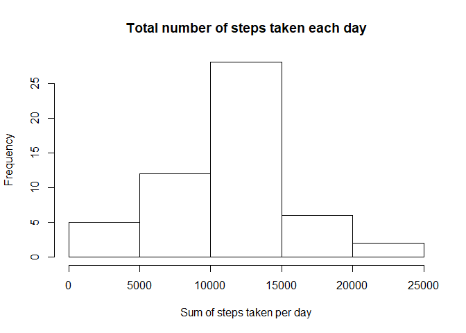
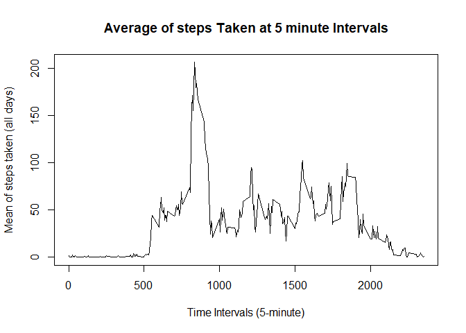
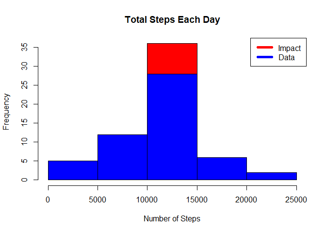

## Loading and preprocessing the data
  

```r
    fileUrl <- "https://d396qusza40orc.cloudfront.net/repdata%2Fdata%2Factivity.zip"
    fileTmp <- tempfile()
  
    download.file(fileUrl, fileTmp, mode="wb", method="curl")
    unzip(fileTmp, "activity.csv")
    tbAct <- read.table("activity.csv", sep=",", header=T)
```
    
## What is mean total number of steps taken per day?
  
1. Make a histogram of the total number of steps taken each day

```r
    tbAct_Steps_Sum <- aggregate(steps ~ date, data = tbAct, sum, na.rm = TRUE)
    
    hist(tbAct_Steps_Sum$steps,main="Total number of steps taken each day",xlab="Sum of steps taken per day",cex.axis=1,cex.lab = 1)
```

<!-- -->
    
2. Calculate and report the mean and median total number of steps taken per day
    
    ```r
    tbAct_Steps_Mean <- round(mean(tbAct_Steps_Sum$steps))
    print(c("The mean is: ",tbAct_Steps_Mean))        # 10766
    ```
    
    ```
    ## [1] "The mean is: " "10766"
    ```
    
    ```r
    tbAct_Steps_Median <- round(median(tbAct_Steps_Sum$steps))
    print(c("The median is: ",tbAct_Steps_Median))    # 10765
    ```
    
    ```
    ## [1] "The median is: " "10765"
    ```
  
## What is the average daily activity pattern?
1. Make a time series plot (i.e. type = "l") of the 5-minute interval (x-axis) and the average number of steps taken, averaged across all days (y-axis)

```r
    tbAct_Steps_Interval <- aggregate(steps ~ interval, data = tbAct, mean, na.rm = TRUE)
    plot(steps ~ interval, data = tbAct_Steps_Interval, type = "l", xlab = "Time Intervals (5-minute)", ylab = "Mean of steps taken (all days)", main = "Average of steps Taken at 5 minute Intervals")
```

<!-- -->

2. Which 5-minute interval, on average across all the days in the dataset, contains the maximum number of steps?

```r
    tbAct_Steps_MaxInterval <- tbAct_Steps_Interval[which.max(tbAct_Steps_Interval$steps),"interval"]
    print(c("The maximum number of steps is: ",tbAct_Steps_MaxInterval))        # 835
```

```
## [1] "The maximum number of steps is: " "835"
```
    
## Imputing missing values
1. Calculate and report the total number of missing values in the dataset (i.e. the total number of rows with NAs)

```r
    tbAct_Missing_values <- sum(!complete.cases(tbAct))
    print(c("Count of missing values: ",tbAct_Missing_values)) #2304
```

```
## [1] "Count of missing values: " "2304"
```
    
2. Devise a strategy for filling in all of the missing values in the dataset. The strategy does not need to be sophisticated. For example, you could use the mean/median for that day, or the mean for that 5-minute interval, etc.
  

```r
    tbAct_Steps_avg <- aggregate(steps ~ interval, data = tbAct, FUN = mean)
    fillNA <- numeric()
    for (i in 1:nrow(tbAct)) {
      obs <- tbAct[i, ]
      if (is.na(obs$steps)) {
        steps <- subset(tbAct_Steps_avg, interval == obs$interval)$steps
      } else {
        steps <- obs$steps
      }
      fillNA <- c(fillNA, steps)
    }
```
    
3. Create a new dataset that is equal to the original dataset but with the missing data filled in.

```r
  tbAct_V2 <- tbAct
  tbAct_V2$steps <- fillNA
```
    
4. Make a histogram of the total number of steps taken each day and Calculate and report the mean and median total number of steps taken per day. Do these values differ from the estimates from the first part of the assignment? What is the impact of imputing missing data on the estimates of the total daily number of steps?  
  

```r
  tbAct_Steps_Sum_Union <- aggregate(steps ~ date, data = tbAct_V2, sum, na.rm = TRUE)
  hist(tbAct_Steps_Sum_Union$steps, main = paste("Total Steps Each Day"), col="red", xlab="Number of Steps")

  hist(tbAct_Steps_Sum$steps, main = paste("Total Steps Each Day"), col="blue", xlab="Number of Steps", add=T)
  legend("topright", c("Impact ", "Data"), col=c("red", "blue"), lwd=5)
```

<!-- -->
    
    
## Are there differences in activity patterns between weekdays and weekends?
    
1. Create a new factor variable in the dataset with two levels -- "weekday" and "weekend" indicating whether a given date is a weekday or weekend day.

```r
  tbAct_V2$day <- ifelse(as.POSIXlt(as.Date(tbAct_V2$date))$wday%%6 == 0, "weekend", "weekday")
  tbAct_V2$day <- factor(tbAct_V2$day, levels = c("weekday", "weekend"))
```
  
2. Make a panel plot containing a time series plot (i.e. type = "l") of the 5-minute interval (x-axis) and the average number of steps taken, averaged across all weekday days or weekend days (y-axis). The plot should look something like the following, which was created using simulated data:

```r
  tbAct_Steps_Interval = aggregate(steps ~ interval + day, tbAct_V2, mean)
  library(lattice)
  xyplot(steps ~ interval | factor(day), data = tbAct_Steps_Interval, aspect = 1/2, 
         type = "l")
```

<!-- -->
